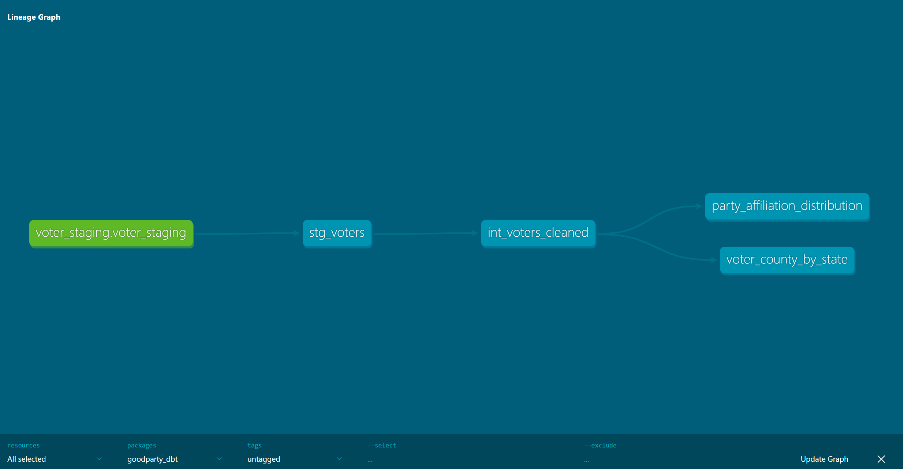

# GoodParty Voter Pipeline

This project demonstrates a **dbt + Airflow voter data pipeline**. It ingests voter data, standardizes it, computes key metrics, and produces visualizations for reporting.

## Getting Started

Follow these steps to set up and run the pipeline locally:

### 1. Clone the repository

    git clone https://github.com/vidiotrp/goodparty_voter_pipeline.git
    cd goodparty_voter_pipeline

### 2. Install Python dependencies
Create and activate a virtual environment, then install packages.  

    pip install -r requirements.txt

### 3. Set up environment variables
Set your Postgres connection info. You can use a `.env` file or export variables manually:  

    $env:POSTGRES_USER="<username>"
    $env:POSTGRES_PASSWORD="<password>"
    $env:POSTGRES_DB="<database>"

### 4. Start Airflow
Make sure Airflow is installed and initialized.

### 5. Initialize dbt

---

## Project Overview

The pipeline consists of:

1. **Ingestion & Orchestration (Airflow)**  
   - Raw voter data is ingested from the source system.
   - Airflow DAG manages dependencies and schedules the pipeline.

2. **Staging (`stg_voters`)**  
   - Raw data is loaded into a staging table for initial cleanup and validation.

3. **Intermediate (`int_voters_cleaned`)**  
   - Data is cleaned and standardized:
     - Names capitalized
     - Emails lowercased
     - Missing data flags (`missing_email`, `missing_age`, etc.)
     - States standardized to 2-letter abbreviations

4. **Marts**  
   - Aggregate metrics for reporting:
     - `voter_county_by_state`: voters by state, gender, age metrics, missing emails, voters not voted in last year
     - `party_affiliation_distribution`: voters by party, gender, age metrics, missing emails, voters not voted in last year

---

## Pipeline Status

### Airflow & dbt

| Airflow DAG Run | dbt Lineage Graph | dbt Tests (with intentional failures) |
|-----------------|-----------------|--------------------------------------|
| [](screenshots/airflow_success.png) | [](screenshots/dbt_lineage_graph.png) | [](screenshots/dbt_test_with_intentional_failures.png) |

---

## Visualizations

### Voter Counts

| Voter Count by State | Male vs Female Voters by State |
|---------------------|-------------------------------|
| [](charts/voter_count_by_state.png) | [](charts/voter_gender_by_state.png) |

### Party Metrics

| Total Voters by Party |
|----------------------|
| [](charts/voter_count_by_party.png) |

---

## File Structure
```
goodparty_voter_pipeline/
│
├─ dbt/
│ ├─ goodparty_dbt/
│ │ ├─ models/ # dbt models (staging, intermediate, marts)
│ │ ├─ macros/ # dbt macros (unused)
│ │ ├─ snapshots/ # dbt snapshots (unused)
│ │ └─ dbt_project.yml # dbt project configuration
│ └─ logs/ # dbt run logs
├─ scripts/ # Python scripts for ingestion and visualization
├─ charts/ # Generated visualization PNG files
├─ screenshots/ # Pipeline screenshots
├─ dags/ # Airflow DAG definitions
└─ README.md
```


## Notes

- Some dbt tests were intentionally left failing to demonstrate quality checks.
- All states are standardized to 2-letter abbreviations.
- Null states were removed in some visualization scripts to visualize better. They could be addressed elsewhere in the pipeline based on business requirements.
- Visualization scripts generate charts in `charts/` using Matplotlib.
- Clicking on any image will open the full-size PNG in a new tab.

